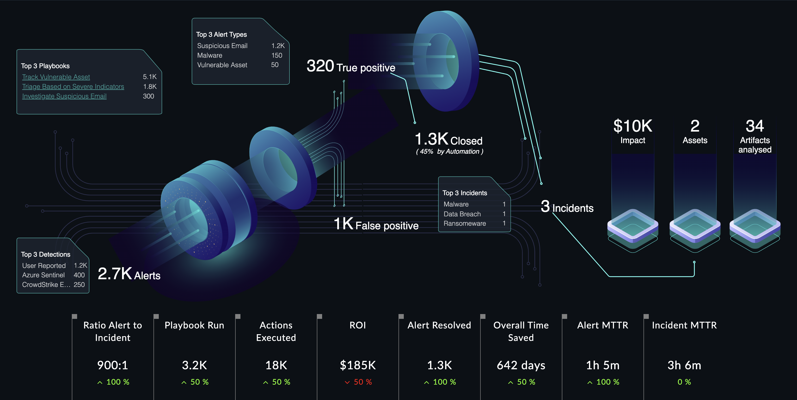

## Release Information

- **Version**: 2.1.0

- **Certified**: Yes

- **Publisher**: Fortinet  

- **Compatibility**: 7.2.2 and later

- **Applicable**: Dashboards

- [Release Notes](./widget/release_notes.md)

## Overview

Introducing the SOC Management widget – your comprehensive visual companion for investigating scenarios within a Security Operations Center (SOC). In a single, powerful image, this widget provides an overview of SOC investigations, highlighting key metrics and insights.

Get a holistic view of your SOC's activities, including the number of alerts generated, alert types, closure rates, and categorizations like False Positive or True Positive, all within the specified time frame. The widget also showcases vital information about the top three playbooks, data sources, alert types, ROI, and playbook execution.

Additionally, gain valuable insights into incidents with details on the top three incident types, associated assets, and analyzed artifacts. This information empowers SOC teams to make informed decisions and prioritize investigations effectively.

With its visually engaging and intuitive design, the SOC Management widget offers a seamless experience for SOC professionals, enabling them to analyze and monitor investigations at a glance. Stay on top of your SOC operations with this essential tool.

## Next Steps

| [Installation](./docs/setup.md#installation) | [Configuration](./docs/setup.md#configuration) | [Usage](./docs/usage.md) |
|----------------------------------------------|------------------------------------------------|--------------------------|

