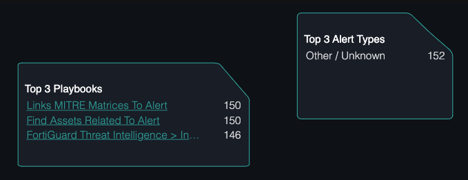
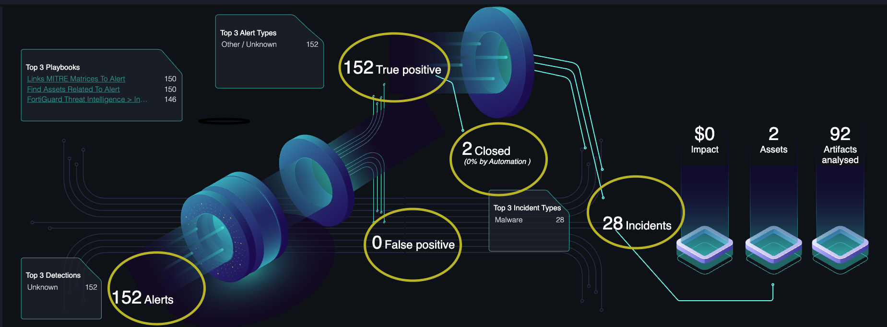
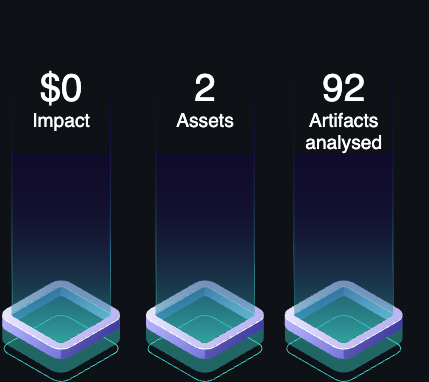
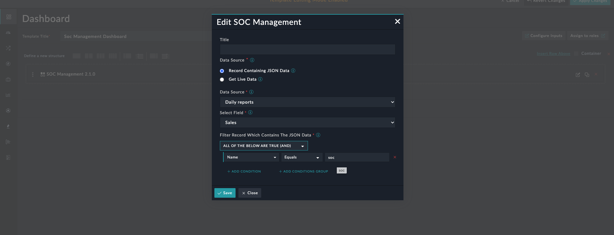

| [Home](../README.md) |
|--------------------------------------------|

# Usage


**SOC Management Widget Edit View**:
**Live Data**


**SOC Management Widget - Dashboard View**:
**Dark Theme**


**Light Theme**


The following matrices are displayed by the SOC Management Widget:

- The total number of alerts present on your system that are filtered based on the field and time range you have specified. In our case, we have specified alerts that were created in the last 7 days, which comes to 1.3K alerts (in our example).  The total alerts are further classified into:
  - True Positive alerts (1.3K)
  - False Positive alerts (1)
  - Closed alerts (2)
  - Total number of incidents (13) 
- The **Top 3 Data Sources** for the alerts created in the specified time range. In our example they are, FortiSIEM, Splunk, and User Reported.
- The **Top 3 Playbooks** that were executed in the specified time range. In our example they are, Indicator (Type IP) - Get Reputation, Compute Alert Priority Weight (Post Indicator Extraction), and Create Alerts.
  You can click the names of the playbook to open the respective playbook in the Playbook Designer. 
- The **Top 3 Alert Types** of the alerts created in the specified time range. In our example they are, Denial of Service, Lost / Stolen, and Brute Force Attack.
- The **Top 3 Incident Types** of the incidents that were created in the specified time range. In our example they are, Malware, Beaconing, and Denial of Service.
- The **Impact** of the incidents in terms of savings in the dollars in the specified time range.  In our example, it is $385.   
    **Important**: To view this information, a new field named '**Impact ROI**' is added to the 'Incident' module. The 'Impact ROI' field can be added using any of the following methods:
    - Upgrade the SOAR Framework Solution pack to version 2.0.0 or later.
    - Add the **Impact ROI** as an 'Integer' type field to the Incident module in your system and then add the field to the System View Templates (SVT)  of the incident module. For information on adding fields to a module, see the 'Module Editor' topic in the 'Administration Guide', and for adding a field to the SVT of the module, see the 'Dashboards, Templates, and Widgets' chapter in the 'User Guide'; both the guides are part of the FortiSOAR product documentation.
- The count of **Assets** associated with the incidents in the specified time range. 
- The number of **Artifacts Analyzed** that are associated with the incidents in the specified time range.    
- Apart from these matrices, the widget also includes the following matrices:
  - **Ratio Alert to Incident** displays the ratio of the total number of alerts to the number of alerts that were escalated to incidents in the specified time range.
  - **Playbook Run** displays the total number of playbooks executed in the specified time range.
  - **Actions Executed** displays the total number of playbook actions executed in the specified time range.
  - **ROI** displays the ROI of playbook actions executed in terms of savings in the dollars in the specified time range. 
    While calculating ROI it is considered, to manually make API call it will take 5 minutes and an analyst would charge 60$ per hour.
    For example, if the widget is configured for 1 day, and the actions executed in the day are 10 then the ROI would be $50.
  - **Alert Resolved** displays the total number of alerts resolved in the specified time range.
  - **Overall Time Saved** displays the time saved by executing playbook actions in the specified time range. 
    Overall time saved is calculated by multiplying the actions executed count by 5 minutes,  i.e. the time taken by an analyst to manually do the task. The value is displayed in hrs. 
    eg. if the actions executed are 97, the overall time saved will be (97x5)/60 = 8hrs.
  - **Alert MTTR** displays the mean time it took to resolve alerts in the specified time range.
  - **Incident MTTR** displays the mean time it took to resolve incidents in the specified time range.

  **Percentage Value**
  The Percentage value is the difference between the time period given while configuration and the the data prior to the number of days given while configuration.  
  eg. For ROI if the date is 20/12/2022 and the widget is configured for 10 days then the percentage is for the (ROI obtained from 10/12-20/12) - (ROI obtained from 1/12-9/12) .

    Known behaviour:
    1. If no data is present for the time period before for which the widget has been configured, then the percentage increase will be 100%.
    2. If a playbook has execution history but has been deleted and comes into the top3playbooks box then the hyperlink will redirect to "Page not found".
<hr>

  # Data Source :  'Record Containing JSON Data' Option

  Use this option to populate the widget using a json.
  The Json object must be present as a record in any of the modules.
  
  JSON data:

  Format to follow in the json to populate the data seamlessly


    
```JSON 
  {
  "kpi": [
    {
      "id": "ratio",
      "title": "Ratio Alert to Incident",
      "value": "900:1",
      "increase": true,
      "sequence": 1,
      "percentChange": 100
    },
    {
      "id": "playbookRun",
      "title": "Playbook Run",
      "value": "3.2K",
      "increase": true,
      "sequence": 2,
      "percentChange": 50
    },
    {
      "id": "actionExecuted",
      "title": "Actions Executed",
      "value": "18K",
      "increase": true,
      "sequence": 3,
      "percentChange": 50
    },
    {
      "id": "roi",
      "title": "ROI",
      "value": "$185K",
      "sequence": 4,
      "percentChange": 50
    },
    {
      "id": "alertResolved",
      "title": "Alert Resolved",
      "value": "1.3K",
      "increase": true,
      "sequence": 5,
      "percentChange": 100
    },
    {
      "id": "overallTimeSaved",
      "title": "Overall Time Saved",
      "value": "642 days",
      "increase": true,
      "sequence": 6,
      "percentChange": 50
    },
    {
      "id": "alertMttr",
      "title": "Alert MTTR",
      "value": "1h 5m",
      "increase": true,
      "sequence": 7,
      "percentChange": 100
    },
    {
      "id": "incidentMttr",
      "title": "Incident MTTR",
      "value": "3h 6m",
      "increase": true,
      "sequence": 8,
      "percentChange": 0
    }
  ],
  "dataBoxes": [
    {
      "id": "idTopThreeIncidents",
      "data": {
        "Malware": 132,
        "Data Breach": 11,
        "Ransomeware": 12
      },
      "title": "Top 3 Indicators"
    },
    {
      "id": "idTopThreeAlerts",
      "data": {
        "Malware": 150,
        "Suspicious Email": 1200,
        "Vulnerable Asset": 50
      },
      "title": "Top 3 Alert Types"
    },
    {
      "id": "idAutomationCalculation",
      "data": {
        "Track Vulnerable Asset": 5150,
        "Investigate Suspicious Email": 300,
        "Triage Based on Severe Indicators": 1850
      },
      "title": "Top 3 Playbooks",
      "template_iri": [
        "/api/3/workflows/e3137f50-34ca-44e9-85d4-1b840ab0cb38",
        "/api/3/workflows/e3137f50-34ca-44e9-85d4-1b840ab0cb38",
        "/api/3/workflows/e3137f50-34ca-44e9-85d4-1b840ab0cb38"
      ]
    },
    {
      "id": "idIncomingAlertSources",
      "data": {
        "User Reported": 1200,
        "Azure Sentinel": 400,
        "CrowdStrike EDR": 250
      },
      "title": "Top 3 Detections"
    }
  ],
  "alertsFlow": [
    {
      "id": "idIncidentsLabel",
      "title": "Incidents",
      "value": 3
    },
    {
      "id": "idTruePositiveLabel",
      "title": "True positive",
      "value": "320"
    },
    {
      "id": "idFlasePositiveLabel",
      "title": "False positive",
      "value": "1K"
    },
    {
      "id": "idResolvedAutomated",
      "title": "by Automation )",
      "value": "( 45% "
    },
    {
      "id": "idClosedLabel",
      "title": "Closed",
      "value": "1.3K"
    },
    {
      "id": "idAlertLabel",
      "title": "Alerts",
      "value": "2.7K"
    }
  ],
  "impactAnalysis": [
    {
      "id": "idArtifactsDivision",
      "title": "Artifacts analysed",
      "value": 34
    },
    {
      "id": "idAssetsDivision",
      "title": "Assets",
      "value": 2
    },
    {
      "id": "idImpactDivision",
      "title": "Impact",
      "value": "$10K"
    }
  ]
  }
  ```


  Keys, "kpi, dataBoxes, impactAnalysis, alertsFlow" represents following respectively :-
  - Key Performance Indices(kpi) 
  
  - Data boxes(dataBoxes), Top 3 playbooks, Top 3 Alert types etc 

   - Alerts Flow(alertsFlow) 

   
   - Impact Analysis ( impactAnalysis ) 
   - 


  eg.
  - Select the module, (Daily report in this case)
  - Select the field
  - Use the filter condition to filter out the record which contains the data
  
   Detailed view of the record
  

  
  


