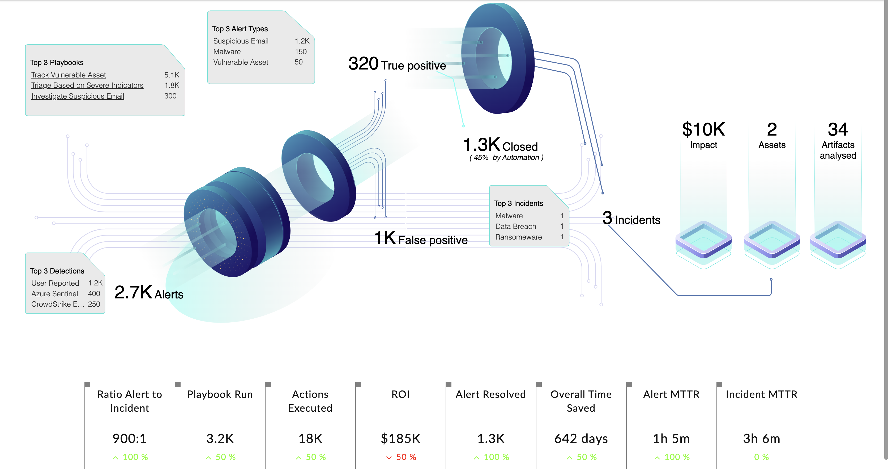

| [Home](../README.md) |
|----------------------|

# Usage

The **SOC Management** widget provides an overall view of an investigation scenario in a Security Operations Center(SOC). In a single image it displays the overall picture of the investigations carried out in a SOC such as, count of alerts created, type of alerts, count of alerts out of total closed, alerts categorized as *False Positive*, or *True Positive* in the specified time frame.

It also displays information about the top three playbooks, data sources, alert types, the ROI, and playbooks run, top three incident types, their associated assets, and analyzed artifacts, and other helpful information.

## Matrices Displayed

As an example of SOC Management widget's capabilities, consider the following image:


The image showcases the following matrices:

- The total number of alerts &mdash; created in the last **7** days. The count of alerts are further classified as follows:
    - 320 True Positive alerts
    - 1K False Positive alerts
    - 1.3K Closed alerts
    - 3 incidents

- The **Top 3 Detections** for the alerts
    - User Reported
    - Azure Sentinel
    - CrowdStrike EDR

- The **Top 3 Playbooks**
    - Track Vulnerable Asset
    - Triage Based on Severe Indicators
    - Investigate Suspicious Email

    Click the playbook name to open it in the playbook designer

- The **Top 3 Alert Types**
    - Malware
    - Ransomware
    - Vulnerable Asset

- The **Top 3 Incident Types**
    - Malware
    - Beaconing
    - Denial of Service

- The **Impact** of the incidents in terms of savings

    >**IMPORTANT**: Refer to the section [Configuring Impact ROI](./setup.md#configuring-impact-roi) for more information

- The count of **Assets** associated with the incidents in the specified time range.

- The number of **Artifacts Analyzed** that are associated with the incidents in the specified time range.

Apart from these matrices, the widget also includes the following matrices:

- **Ratio Alert to Incident** displays the ratio of the total number of alerts to the number of alerts that were escalated to incidents in the specified time range.

- **Playbook Run** displays the total number of playbooks executed in the specified time range.

- **Actions Executed** displays the total number of playbook actions executed in the specified time range.

- **ROI** displays the ROI of playbook actions executed in terms of savings in the dollars in the specified time range. 

    ROI calculations consider the following:
    - API calls are manual
    - Time taken is 5 minutes
    - An analyst charges $60/hour

- **Alert Resolved** displays the total number of alerts resolved in the specified time range.

- **Overall Time Saved** displays the time saved by executing playbook actions in the specified time range. It is calculated using following data:
    - Time taken for an action is 5 minutes
    - Count of actions

        > If 97 actions were executed, the overall time saved is (97x5)/60 = 8hrs

- **Alert MTTR** displays the mean time it took to resolve alerts in the specified time range.
- **Incident MTTR** displays the mean time it took to resolve incidents in the specified time range.

**Percentage Value** is the difference in percentage value for the specified time period, and the percentage value of the same duration before the specified time period.

<hr>
Considering the following:

- Today is 12 July 2023
- Percentage calculations are for ROI
- Specified time duration in widget configuration was 7 days

The percentage value is the difference between:

- ROI percentage for the last 7 days (6 July 2023 &ndash; 12 July 2023)

    and

- ROI percentage for the 7 days prior to the specified duration (30 June 2023 &ndash; 5 July 2023)

<hr>

### Known behavior

1. If no data is present for the time period before for which the widget has been configured, then the percentage increase will be 100%.

2. If a playbook has execution history but has been deleted and comes into the top3playbooks box then the hyperlink will redirect to "Page not found".

## Configuring SOC Management Widget

The SOC Management widget displays data fetched from following sources:

- Live Data

- Records containing JSON data

### Get Live Data

1. Edit a *Dashboard*'s or a module record's view template and select **Add Widget** button.

2. Select **SOC Management** from the list to bring up the **SOC Management** widget's customization modal.

3. Specify the title of this visual depiction in the **Title** field.

    

4. Select **Get Live Data** in the **Data Source** field.

5. Select a field and a time range to retrieve information.

    1. Select one of the following fields to display the containing information in the **Where** field:

        - Response SLA Paused Date
        - Ack SLA Paused Date
        - Response Date
        - Ack Date
        - Assigned Date
        - Resolved Date
        - Detection Date
        - Ack Due Date
        - Response Due Date
        - Created On
        - Modified On
    
    2. Specify the time range, in days, in the **Days** field.

6. Specify the playbook tags to exclude from the displayed information in the **Exclude Playbooks with Tags** field.

### Records containing JSON data

1. Edit a *Dashboard*'s or a module record's view template and select **Add Widget** button.

2. Select **SOC Management** from the list to bring up the **SOC Management** widget's customization modal.

3. Specify the title of this visual depiction in the **Title** field.

    

4. Select **Records containing JSON data** in the **Data Source** field.

5. Select the data source from where to fetch information JSON data in the **JSON Data Source Modules** field. The dropdown lists only those modules which support JSON data in their records.

6. Define filters under the field **Filter Record Which Contains The JSON Data** to fetch records that contain relevant data.

Following is the JSON format to populate the data for the widget:
    
```JSON
{
  "kpi": [
    {
      "id": "ratio",
      "title": "Ratio Alert to Incident",
      "value": "900:1",
      "increase": true,
      "sequence": 1,
      "percentChange": 100
    },
    {
      "id": "playbookRun",
      "title": "Playbook Run",
      "value": "3.2K",
      "increase": true,
      "sequence": 2,
      "percentChange": 50
    },
    {
      "id": "actionExecuted",
      "title": "Actions Executed",
      "value": "18K",
      "increase": true,
      "sequence": 3,
      "percentChange": 50
    },
    {
      "id": "roi",
      "title": "ROI",
      "value": "$185K",
      "sequence": 4,
      "percentChange": 50
    },
    {
      "id": "alertResolved",
      "title": "Alert Resolved",
      "value": "1.3K",
      "increase": true,
      "sequence": 5,
      "percentChange": 100
    },
    {
      "id": "overallTimeSaved",
      "title": "Overall Time Saved",
      "value": "642 days",
      "increase": true,
      "sequence": 6,
      "percentChange": 50
    },
    {
      "id": "alertMttr",
      "title": "Alert MTTR",
      "value": "1h 5m",
      "increase": true,
      "sequence": 7,
      "percentChange": 100
    },
    {
      "id": "incidentMttr",
      "title": "Incident MTTR",
      "value": "3h 6m",
      "increase": true,
      "sequence": 8,
      "percentChange": 0
    }
  ],
  "dataBoxes": [
    {
      "id": "topThreeIncidents",
      "data": {
        "Malware": 1,
        "Data Breach": 1,
        "Ransomware": 1
      },
      "title": "Top 3 Incidents"
    },
    {
      "id": "topThreeAlertTypes",
      "data": {
        "Malware": 150,
        "Suspicious Email": 1200,
        "Vulnerable Asset": 50
      },
      "title": "Top 3 Alert Types"
    },
    {
      "id": "topThreePlaybooks",
      "data": {
        "Track Vulnerable Asset": 5150,
        "Investigate Suspicious Email": 300,
        "Triage Based on Severe Indicators": 1850
      },
      "title": "Top 3 Playbooks",
      "template_iri": [
        "/api/3/workflows/e3137f50-34ca-44e9-85d4-1b840ab0cb38",
        "/api/3/workflows/e3137f50-34ca-44e9-85d4-1b840ab0cb38",
        "/api/3/workflows/e3137f50-34ca-44e9-85d4-1b840ab0cb38"
      ]
    },
    {
      "id": "topThreeDetections",
      "data": {
        "User Reported": 1200,
        "Azure Sentinel": 400,
        "CrowdStrike EDR": 250
      },
      "title": "Top 3 Detections"
    }
  ],
  "alertsFlow": [
    {
      "id": "totalIncidents",
      "title": "Incidents",
      "value": 3
    },
    {
      "id": "truePositives",
      "title": "True positive",
      "value": "320"
    },
    {
      "id": "falsePositives",
      "title": "False positive",
      "value": "1K"
    },
    {
      "id": "resolvedAutomatedly",
      "title": "by Automation )",
      "value": "( 45% "
    },
    {
      "id": "closed",
      "title": "Closed",
      "value": "1.3K"
    },
    {
      "id": "totalAlerts",
      "title": "Alerts",
      "value": "2.7K"
    }
  ],
  "impactAnalysis": [
    {
      "id": "artifactsAnalysed",
      "title": "Artifacts analysed",
      "value": 34
    },
    {
      "id": "totalAssets",
      "title": "Assets",
      "value": 2
    },
    {
      "id": "impact",
      "title": "Impact",
      "value": "$10K"
    }
  ]
}
```

## SOC Management Widget - Dashboard View

###  Dark Theme


### Light Theme



### JSON Data Source Modules

Following images contain annotations that highlight the JSON keys `kpi`, `dataBoxes`, `impactAnalysis`, and `alertsFlow`:

- Key Performance Indices(`kpi`)

    

- Data boxes(`dataBoxes`) such as *Top 3 playbooks*, *Top 3 Alert types* etc.

    

- Alerts Flow(`alertsFlow`)

    

- Impact Analysis (`impactAnalysis`)

    

### Record Detailed view

Following image shows the detailed view of a record that contains JSON data:


### Troubleshooting

**Error**: `Key Not Found`

**Reason**: When a key is missing from a key-value pair of a JSON data in the records, this error is returned.

**Remediation**:

Validate the JSON data in the record. You may use a JSON validator tool to identify the missing keys from the key-value pair.

| [Installation](./setup.md#installation) | [Configuration](./setup.md#configuration) |
|-----------------------------------------|-------------------------------------------|